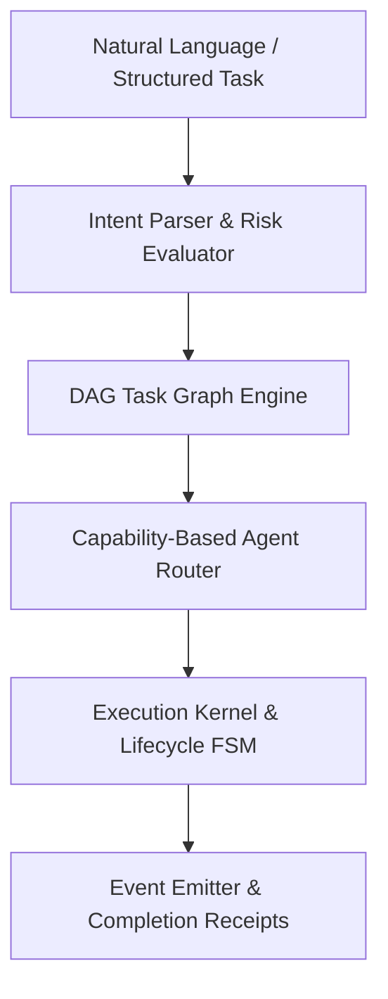

# Architecture: Ayeixa OpenCoordinator

## Overview
Ayeixa OpenCoordinator provides a modular, dependency-free TypeScript kernel for coordinating autonomous multi-agent workloads.

## System Topology

## Component Guarantees
1. **Deterministic DAG Resolution**: Cycles are detected and rejected fail-closed before execution starts.
2. **Strict Stage Isolation**: Independent tasks are batched into parallel stages while respecting dependency barriers.
3. **Fail-Closed State Machine**: Task failures trigger structured error propagation without corrupting adjacent task states.
