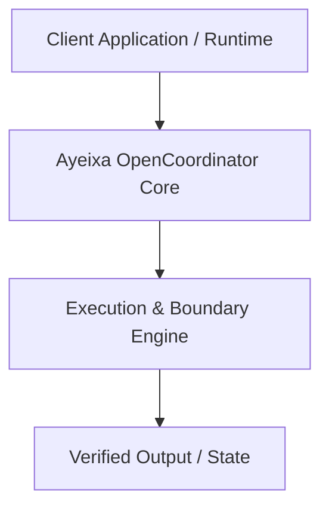

# Architecture Specification: Ayeixa OpenCoordinator

## System Overview
Architecture overview for Ayeixa OpenCoordinator

## Architecture Diagram (Mermaid)

## Design Guarantees
- **Permissive & Standalone**: Operates hermetically without proprietary enterprise lock-in.
- **Fail-Closed**: Rejects malformed or untrusted inputs at boundary layer.
